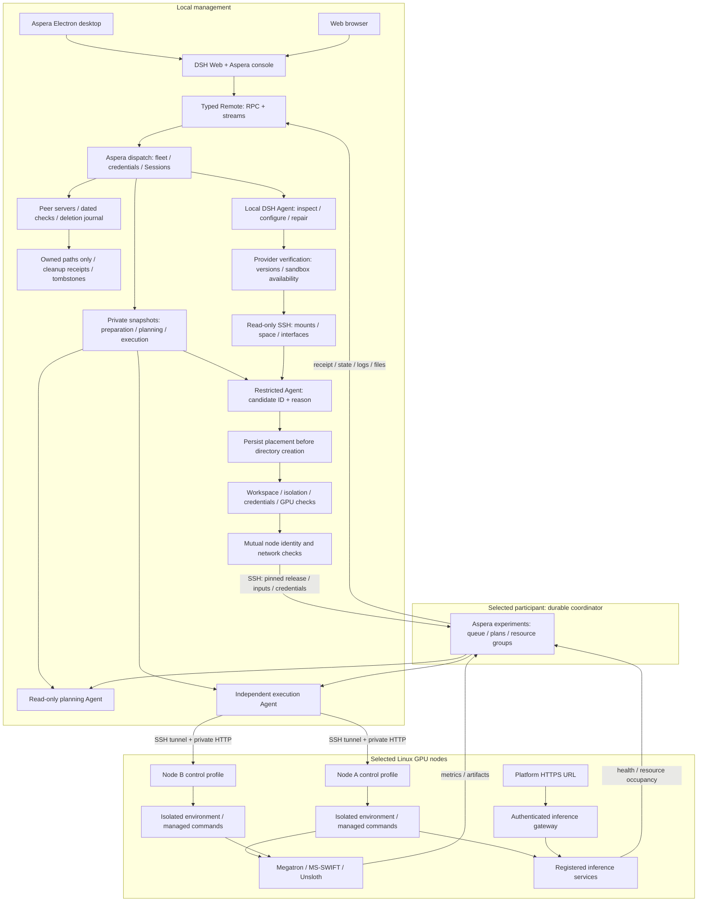

# Aspera architecture

English | [中文](architecture.zh.md)

## Summary

Aspera owns experimental work outside the Harness source tree. Published DSH supplies composition, Agents, Goals, Sessions, credentials, subprocess management and Web slots; Aspera supplies task records, scheduling, remote execution and management views.

## Table of Contents

- [Components](#components)
- [Architecture diagrams](#architecture-diagrams)
- [Execution and ownership](#execution-and-ownership)
- [Extension points](#extension-points)

-----

<a id="components"></a>
## Components

| Package | Owns | Integration |
| --- | --- | --- |
| `@aspera/experiments` | Versioned requests, whole-group scheduling, logs and artifact access | `ExperimentTable` and `ClusterExecutor` |
| `@aspera/runtime` | Persistent control roles, confined node processes, planning/execution Agents and framework guidance | Published DSH profile services |
| `@aspera/dispatch` | Server registry, input staging, release transfer, independent dispatch Sessions and generated Remotes | `ExperimentFleet` and `FleetDriver` |
| `@aspera/console` | Sidebar page, forms, record stream and per-source log cursors | Published Web slots, locale dictionaries and Remote descriptors |
| `@aspera/desktop` | Independent window, tray and local profile lifecycle | Electron and a published `dsh` profile |

The adapter retains two version-checked published-package patches: an additive sidebar group slot and forwarding of the existing settings command. The official shell, conversations and plugin manager stay in DSH. Private provider snapshots feed [phase contexts](../packages/runtime/README.md#understand-the-implementation) that bind the standard DSH Agent driver to its provider for preparation, planning and execution; public records expose only their model summaries.

Host programs compile against installed package declarations. The Typert shim in [types/typert-protocol.d.ts](../types/typert-protocol.d.ts) belongs only to the generator program and exposes the registration metadata its analysis needs. Browser wrapping in [tsdown.config.ts](../packages/console/tsdown.config.ts) contains Cordis-compatible CommonJS module loading and CSS insertion; the compiled public client declarations remain separate from the JavaScript bundle.

-----

<a id="architecture-diagrams"></a>
## Architecture diagrams

Desktop and browser share the page and task service. The remote coordinator owns execution after durable handover; the local carrier does not own GPU processes.



Handover completes the original dispatch Goal. Confirmation, whole-group allocation, execution and inference-service lifetime remain remote experiment states.

```mermaid
sequenceDiagram
  actor User
  participant UI as Desktop / Web page
  participant Fleet as Local dispatch
  participant Queue as Remote coordinator
  participant Agent as Planning / execution Agent
  participant Node as Selected GPU nodes
  User->>UI: Submit Goal, server group and coordinator
  UI->>Fleet: Validate coordinator and cross-coordinator overlaps
  Fleet-->>UI: Preparing; another Goal can be submitted
  Fleet->>Node: Shell-only inspection; Agent configures dependencies
  Fleet->>Fleet: Persist diagnostics; verify tools and executable paths
  Fleet->>Node: Read mounts, space and network interfaces over SSH
  Fleet->>Fleet: Agent selects candidate; persist paths and reason
  Fleet->>Node: Create owned directories; deploy; verify mutual network
  Fleet->>Queue: Fixed release, inputs and private credentials
  Queue->>Queue: Validate and persist admission
  Queue-->>Fleet: Full handover receipt
  Fleet->>Fleet: Persist receipt; finish matching Goal ID + revision
  Fleet-->>UI: Local dispatch complete; remote experiment accepted
  Queue->>Agent: Prepare framework plan without GPU reservation
  Agent-->>Queue: Persist versioned plan
  opt Semi-automatic mode
    UI->>Fleet: Confirm this plan revision
    Fleet->>Queue: Persist confirmation
  end
  Queue->>Queue: FIFO; allocate the entire free server group
  Queue->>Node: Recheck selected mounts, free space and network
  Queue->>Agent: Start independent execution Session + Goal
  Agent->>Node: Prepare experiment environment; run scoped commands
  Node-->>Queue: Logs, metrics, artifacts and service health
  Queue-->>Fleet: Incremental state and file metadata
  Fleet-->>UI: Reconnectable streams; files downloaded on demand
  opt Semi-automatic unresolved decision
    Agent->>Queue: Save question with Session / tool call / revision
    Agent->>Agent: Pause same Goal; managed commands remain monitored
    Queue-->>UI: Saved question and attention count
    UI->>Queue: Persist validated reply
    Queue-->>Agent: Deliver to original call; resume same Goal
  end
  Note over Queue,Node: Accepted work continues after the local application quits
```

The management profile serializes admission checks. Different coordinators cannot manage unfinished experiments sharing a node; the selected participant is pinned per experiment. Waiting for initial confirmation retains this registration constraint without allocating GPUs. Node controls independently enforce exclusive execution. Terminal record removal uses a durable deletion journal and tombstones; optional SSH cleanup validates saved owners, paths and mounts.

-----

<a id="execution-and-ownership"></a>
## Execution and ownership

The management Host starts the standard DSH preparation Agent with the selected model and existing Session. Shell-only inspection precedes Node-dependent inventory. Scoped SSH tools configure dependencies using the login account's permissions; release requirements determine Node and pnpm versions. The Host saves executable paths, node stages and diagnostics, then verifies each repair. The same Agent selects an observed storage candidate and reason; manual paths take precedence. Selection precedes directory creation. Mount identity, ownership, writes and space are rechecked during preparation, transfer and startup. Sandbox confinement, hidden credentials, CUDA and mutual network proofs gate handover. Kernel/device restrictions remain explicit blockers; model declarations cannot waive checks.

Control state, queues and credentials remain under the login user’s fixed private control directory. Releases and per-experiment inputs, Agent homes, logs, caches, environments, temporary files and artifacts use the selected disk. Node tools expose granted devices, hide the control directory and registered experiment storage roots, and bind only the current workspace writable. Framework cache/environment variables point into that workspace. Network access remains shared for downloads and training; it is not network isolation.

Registered inference processes belong to node controls rather than the execution Agent. Ending the Goal or disconnecting the browser leaves services alive and the full allocation occupied. Coordinator restart resumes service observation; ambiguous training or node-process identity becomes interrupted and retains unconfirmed allocations. Cancellation only frees a group after every node confirms cleanup.

Every release has immutable DSH/extension versions, package files and a frozen production lockfile. New deployments use new directories; profile identities reject rebinding a worker home to another release. Active control processes are reused without replacement. An incompatible control-protocol upgrade waits for old tasks to finish and the old controls to stop before activation.

The runtime extends finite Goal windows through the public Goal service, preserving one execution Session and Goal. Automatic mode rejects human waiting; semi mode persists questions, pauses new Agent operations and routes saved replies to the original tool invocation. The console refreshes the shared attention count independently of page selection; the desktop validates that count before updating Windows overlays and hidden-window tray artwork. Context compaction remains supplied by the DSH base bundle.

-----

<a id="extension-points"></a>
## Extension points

`aspera-single` is the execution preset. Coordination algorithms belong in a `ClusterExecutor` or a runtime coordination plugin; the preset selects roles and capabilities. Alternative topology, routing, evaluation, rounds and stopping rules can use DSH subagents without modifying the Agent loop. A loop replacement requires separate compatibility testing.

An RSI pipeline can consume immutable submissions, input digests, framework execution records, model artifacts, release identities and measured evaluation. Keep candidate data/model/Harness versions separate from the currently published version, evaluate candidates independently, and retain prior releases for rollback. This workspace provides records and execution; it does not implement an RSI optimizer or multi-Agent game algorithm.

See [state and API ownership](state-and-api.md) for versioning and [verification](verification.md) for the current acceptance scope.
