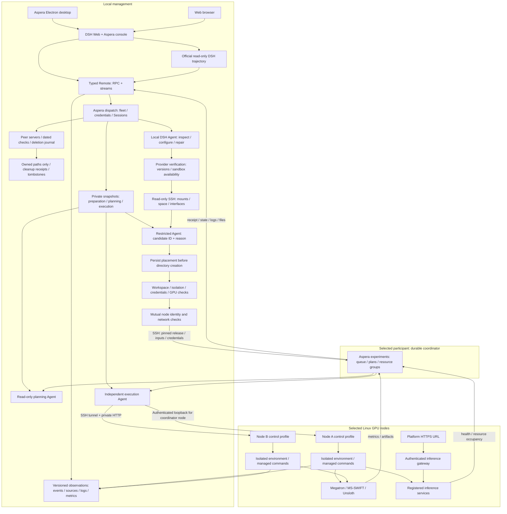

# Aspera 架构

[English](architecture.md) | 中文

## 概要

Aspera 在 Harness 源码树之外管理实验业务。已发布的 DSH 提供装配、Agent、Goal、Session、凭据、子进程管理和 Web 插槽；Aspera 提供任务记录、调度、远端执行和管理视图。

## 目录

- [组件](#components)
- [架构图](#architecture-diagrams)
- [执行与归属](#execution-and-ownership)
- [扩展位置](#extension-points)

-----

<a id="components"></a>
## 组件

| 包 | 负责内容 | 接入方式 |
| --- | --- | --- |
| `@aspera/experiments` | 版本化请求、整组调度、日志和产物访问 | `ExperimentTable` 和 `ClusterExecutor` |
| `@aspera/runtime` | 持久控制角色、隔离的节点进程、规划及执行 Agent、框架知识 | 已发布的 DSH profile 服务 |
| `@aspera/dispatch` | 服务器登记、输入暂存、发布移交、独立派发 Session 和生成的 Remote | `ExperimentFleet` 和 `FleetDriver` |
| `@aspera/console` | 侧栏页面、表单、记录流和按来源区分的日志游标 | 已发布的 Web 插槽、本地化字典和 Remote 描述 |
| `@aspera/desktop` | 独立窗口、托盘和本机 profile 生命周期 | Electron 及已发布的 `dsh` profile |

接入层维护固定版本发布包的补丁，提供侧栏分组、设置命令和含附件渲染的只读轨迹工厂。工厂使用 DSH 的会话组装器、时间轴、记录列表和详情，消费实验自己的事件源，不创建可编辑 Session，也不导入上游源码路径。官方窗口、普通会话及插件管理仍由 DSH 提供。私有模型配置快照供[阶段环境](../packages/runtime/README.zh.md#understand-the-implementation)使用，公开记录只展示模型摘要。

Host 程序依赖已安装包的类型声明。[types/typert-protocol.d.ts](../types/typert-protocol.d.ts) 中的 Typert 兼容声明只用于生成程序，为分析提供注册元数据。[tsdown.config.ts](../packages/console/tsdown.config.ts) 中的浏览器封装负责兼容 Cordis 的 CommonJS 模块加载及 CSS 插入；公开的客户端类型声明与 JavaScript 打包文件独立生成。

-----

<a id="architecture-diagrams"></a>
## 架构图

桌面端与浏览器共用页面和任务服务。持久接管后，远端调度主机管理执行；本机桌面壳不管理 GPU 进程。



接管完成原派发 Goal；确认、整组分配、执行和推理服务生命周期仍属于远端实验状态。

```mermaid
sequenceDiagram
  actor User
  participant UI as Desktop / Web page
  participant Fleet as Local dispatch
  participant Queue as Remote coordinator
  participant Agent as Planning / execution Agent
  participant Node as Selected GPU nodes
  User->>UI: Submit Goal, server group and coordinator
  UI->>Fleet: Validate coordinator and cross-coordinator overlaps
  Fleet-->>UI: Preparing; another Goal can be submitted
  Fleet->>Node: Shell-only inspection; Agent configures dependencies
  Fleet->>Fleet: Persist diagnostics; verify tools and executable paths
  Fleet->>Node: Read mounts, space and network interfaces over SSH
  Fleet->>Fleet: Agent selects candidate; persist paths and reason
  Fleet->>Node: Create owned directories; deploy; verify mutual network
  Fleet->>Queue: Fixed release, inputs and private credentials
  Queue->>Queue: Validate and persist admission
  Queue-->>Fleet: Full handover receipt
  Fleet->>Fleet: Persist receipt; finish matching Goal ID + revision
  Fleet-->>UI: Local dispatch complete; remote experiment accepted
  Queue->>Agent: Prepare framework plan without GPU reservation
  Agent-->>Queue: Persist versioned plan
  opt Semi-automatic mode
    UI->>Fleet: Confirm this plan revision
    Fleet->>Queue: Persist confirmation
  end
  Queue->>Queue: FIFO; allocate the entire free server group
  Queue->>Node: Recheck selected mounts, free space and network
  Queue->>Agent: Start independent execution Session + Goal
  Agent->>Node: Prepare experiment environment; run scoped commands
  Node-->>Queue: Logs, metrics, artifacts and service health
  Queue-->>Fleet: Incremental state and file metadata
  Fleet-->>UI: Reconnectable streams; files downloaded on demand
  opt Semi-automatic unresolved decision
    Agent->>Queue: Save question with Session / tool call / revision
    Agent->>Agent: Pause same Goal; managed commands remain monitored
    Queue-->>UI: Saved question and attention count
    UI->>Queue: Persist validated reply
    Queue-->>Agent: Deliver to original call; resume same Goal
  end
  Note over Queue,Node: Accepted work continues after the local application quits
```

管理 profile 串行校验提交。不同调度主机不能管理使用重叠节点的未结束实验，调度节点按实验固定。首次等待确认仍受此登记限制，但不分配 GPU。节点控制服务独立校验执行独占。结束记录通过持久删除进度及删除标记移除，可选 SSH 清理验证已保存的归属、路径和挂载。

-----

<a id="execution-and-ownership"></a>
## 执行与归属

管理 Host 使用所选模型和现有 Session 启动标准 DSH 准备 Agent。仅依赖 Shell 的探测先于依赖 Node 的清单读取。限定服务器的 SSH 工具使用登录账号权限配置依赖，Node 和 pnpm 版本来自发布要求。Host 保存程序路径、节点阶段及诊断，并复验每次修复。同一 Agent 选择实际存储候选并说明理由，手动目录优先，创建目录前保存选择。准备、上传及启动时复查挂载身份、归属、写入能力和空间。沙箱隔离、凭据隐藏、CUDA 和双向网络证明共同决定能否交接；内核或设备权限限制明确阻塞，模型声明不能免除检查。

控制状态、队列和凭据位于登录用户固定的私有控制目录。发布文件及每个实验的输入、Agent 状态、日志、缓存、环境、临时文件和产物使用选中磁盘。节点工具只暴露获准设备，隐藏控制目录与已登记的实验存储根目录，仅将当前工作目录挂载为可写。框架缓存和环境变量指向该目录。网络仍共享以便下载和训练，此处不提供网络隔离。

登记的推理进程归节点控制服务管理。Goal 结束或浏览器断线后，服务继续运行并占用整组资源。调度服务重启会恢复服务观察；训练结果或节点进程身份不明时标记为中断，保留未确认的资源占用。取消只有在每个节点确认清理后才释放整组资源。

每个发布版本固定 DSH/扩展版本、包文件和冻结的生产依赖锁文件。新部署使用新目录，profile 身份阻止 worker 状态目录被绑定到另一发布版本。正在运行的控制进程直接复用，不被替换。控制协议不兼容的升级需等待旧任务结束、旧控制进程停止后再启用。

运行时通过公开 Goal 服务延长有限轮数窗口，保留同一执行 Session 和 Goal。全自动拒绝人工等待；半自动持久保存问题，暂停新的 Agent 操作，并将保存的回复交给原工具调用。控制台独立于页面选择刷新共用待处理数量，桌面校验计数后更新 Windows 叠加图标和隐藏窗口时的托盘标识。上下文压缩继续由 DSH base bundle 提供。

-----

<a id="extension-points"></a>
## 扩展位置

`aspera-single` 是执行预设。协作算法由 `ClusterExecutor` 或运行时协调插件实现，预设选择角色和能力。其他拓扑、消息路由、评价、轮次和停止规则可以使用 DSH 子 Agent，无需修改 Agent 循环。替换循环需要独立的兼容验证。

RSI 管线可以使用固定提交信息、输入摘要、框架执行记录、模型产物、发布身份和实际评估。候选数据、模型及 Harness 版本与当前发布版本分开，独立评估后再发布，并保留原版本以便回滚。本工程提供记录与执行，不包含 RSI 优化器或多 Agent 博弈算法。

版本化方式见[状态与接口归属](state-and-api.zh.md)，当前验收范围见[验证说明](verification.zh.md)。
